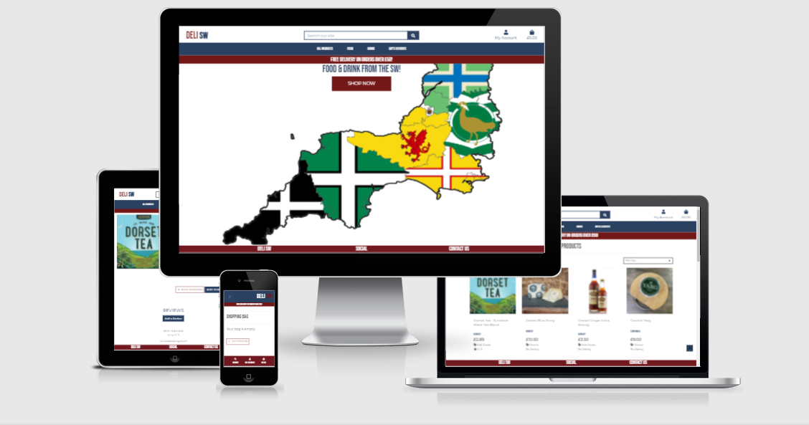

# **CODE INSTITUTE: MILESTONE PROJECT 4**

# **DELI SW**



This is the fourth, and final, Milestone Project for the Full Stack Web Development course provided by Code Institute. The main goal for this project was to produce a "full-stack site based around business logic used to control a centrally-owned dataset. You will set up an authentication mechanism and provide paid access to the site's data and/or activitied based on the dataset, such as the purchase of a product/service." The site is to be built using HTML, CSS, JavaScript, Python+Django, MySQL or Postgres, Stripe and any other relevant libraries and external API's.

A live version of the site can be found [here](https://milestone-4-delisw.herokuapp.com/).

**For testing purposes, please use the following credit card details:**

`Card number:` 4242 4242 4242 4242
`Exp:` any date in the future using MM/YY format
`CSV:` any 3 numbers, ie 424

## **CONTENTS**

- [UX](#ux)
  - [Project Goals](#project-goals)
  - [User Stories](#user-stories)
  - [Design Process](#design-process)
    - [Fonts](#fonts)
    - [Colours](#colours)
    - [Wireframes](#wireframes)
- [Technology Used](#technology-used)
  - [Languages and Frameworks](#languages-and-frameworks)
  - [API's](#API'S)
  - [Tools](#tools)
- [Features](#features)
- [Database Design](#database-design)
- [Testing](#testing)
- [Deployment](#deployment)
  - [Hosting](#hosting)
  - [Local Hosting](#local-hosting)
- [Credits](#credits)
  - [Images](#images)
  - [Image editing](#image-editing)
  - [Coding Ideas](#coding-ideas)
- [Acknowledgements](#acknowledgements)

## **UX**

### <ins>PROJECT GOALS</ins>

The main aim of this website is to provide the **user** with an online delicatessan showcasing the food and drink on offer from the South West of England. 6 Counties have been included: Cornwall, Devon, Dorset, Gloucestershire, Somerset and Wiltshire, and the site is flexible enough to add further Categories, Counties and, of course, Products when needed. The **site owner** has the ability to add event postings to the site which will allow further promotion of the products available to the **user** from this part of the country.

[Back to Contents](#contents)

### <ins>USER STORIES</ins>

- As a **user**, I want to be able to register as a new user on the site.
- As a **user**, I want to be able to log on and off the site after I have registered.
- As a **user**, I want to be able to recover my password if I no longer remember it.
- As a **user**, I want to receive confirmation emails throughout the registration process.
- As a **user**, I want to have a personal profile.
- As a **user**, I want to be able to view all the products available for purchase.
- As a **user**, I want to be able to view products by Category/Price/Rating.
- As a **user**, I want to be able to see more detailed product information about products I am interested in.
- As a **user**, I want to be able to view the content, and associated cost, of my "bag" throughout my site use.
- As a **user**, I want to be able to see all products from a specific County.
- As a **user**, I want to be able to add products to my basket easily.
- As a **user**, I want to be able to view the items in my basket.
- As a **user**, I want to be able to adjust the quantity of items in my basket.
- As a **user**, I want to be able to easily enter my payment details.
- As a **user**, I want to be able to view an order confirmation after checkout.
- As a **user**, I want to be able to Add a review for a specific product.
- As a **user**, I want to be able to Edit a review for a product that I have added.
- As a **user**, I want to be able to Delete a review for a product that I have added.
- As a **user**, I want to be able to see what events are happening within the region.
- As a **user**, I want to be able to search the site for products using key words.
- As a **user**, I want the site navigation to be inuitive and easy to use.
- AS a **user**, I want the information to be displayed in a clear and organised manner to allow for quick decisions to be made.
- As a **site owner**, I want to be able to Add a product to the site.
- As a **site owner**, I want to be able to Edit a product to the site.
- As a **site owner**, I want to be able to Delete a product from the site.
- As a **site owner**, I want to be able to Add an event to the site.
- As a **site owner**, I want to be able to Edit an event on the site.
- As a **site owner**, I want to be able to Delete an event from the site.

[Back to Contents](#contents)

### <ins>DESIGN PROCESS</ins>

1. This site is, again, based on my hospitality background and is as close to an active business

2. The colour scheme chosen was devised using the [Coolors](https://coolors.co/) website. The initial palette had five colours but I decided to reduce this down to three: #2b4162 Indigo Dye, #721817 Persian Plum and #f49f42 Deep Saffron. These choices, along with the white background, make the site stand out on all screen sizes and remains legible for the user at all times.

3. I used [Figma](https://figma.com/) to create my wireframes and used it to organise the flow of the site and how the different pages would respond to the different screen sizes.

4. For this project, I more, or less, stuck to the initial designs as it was largely based on the Boutique Ado site. THis has made the process a lot easier as, previously mentioned, design is not my strong point. One of the key changes was to move the mobile-top navbar to the bottom of the screen. I felt that if you are using a small, hand-held, device having everything at the top of the screen is fairly limiting. We all use our thumbs as well as our fingers and being able to access the Search, My Account and Basket options at the bottom of the screen improved the overall User Experience.

5. I referred to my User Stories and initial wireframes throughout the process and all changes made were to improve the final "look and feel" of the site and to remove the initial design choices that were deemed as inappropriate.

[Back to Contents](#contents)

### <ins>FONTS</ins>

I chose the Bebas Neue font family for all the headers/headline text as it looked contemporary and the complimentary Montserrat font family for he body text throughout the site. This was suggestd via [Google Fonts](https://fonts.google.com/?query=bebas+neue) and provides a sharp, concise look and feel for the site. The font families were imported in to the main base.css file.

### <ins>COLOURS</ins>

The colours mentioned above were chosen to create a sharp, modern look to the site along with the font families. Bootstrap class colours were also used throughout for the toasts and the edit and delete pills.

### <ins>WIREFRAMES</ins>

Initial wireframes for the following pages can be found by clicking on the links below:

- [Landing Page]()
- [All Products]()
- [Register]()
- [Login]()
- [Basket]()
- [Add Product]()
- [Product Detail]()
- [Events]()

[Back to Contents](#contents)

---

## **TECHNOLOGY USED**

### <ins>LANGUAGES AND FRAMEWORKS</ins>

- [HTML](https://developer.mozilla.org/en-US/docs/Web/HTML) - used to create the site structure.
- [CSS](https://developer.mozilla.org/en-US/docs/Web/CSS) - used to create the styling throughout the site.
- [JavaScript](https://developer.mozilla.org/en-US/docs/Web/JavaScript) - this was used for the addition/deletion of ingredients and methods buttons
- [jQuery](https://jquery.com/) - this was used to activate the Materialize functionality.
- [Python](https://www.python.org/) - used to write the logic that operates the site.
- [Django](https://www.djangoproject.com/) - web framework used to allow a modular site to be created.
- [Font-Awesome](https://fontawesome.com/icons?d=gallery) - icons were taken from this site for the forms, header, footer and social buttons.
- [Google fonts](https://fonts.google.com/) - as previously stated, the fonts used were taken from here.
- [Heroku](https://www.heroku.com/home) - used for hosting website.
- [Bootstrap](https://getbootstrap.com/) - used for responsive grid framework, navigation and buttons.
- [Stripe](https://stripe.com/gb) - ecommerce payment system.

### <ins>TOOLS</ins>

- [Git](https://git-scm.com/) - version control and recording of all changes to site during development process.
- [Visual Studio Code](https://code.visualstudio.com/) - IDE used for code editing.
- [Figma](https://figma.com/) - wireframing
- [Google Fonts](https://fonts.google.com/) - used to select font families.
- [W3C Validator](https://validator.w3.org/) - used to test my HTML to ensure there were no errors.
- [W3C Validator CSS](https://jigsaw.w3.org/css-validator/) - used to test my CSS to ensure there were no errors.
- [JSHint](https://https://jshint.com/) - used to test my JS to ensure there were no errors.
- [PEP8 Online](http://pep8online.com/) - used to check my Python was PEP8 compliant.
- [Chrome Developer](https://developers.google.com/web/tools/chrome-devtools) - used to test responsiveness of site throughout the developmnent process and also performance using Lighthouse.
- [Free Formatter](https://freeformatter.com/html-formatter.html#ad-output) - html formatter to help keep things tidy!
- [Am I Responsive](http://ami.responsivedesign.is/#) - used to create responsive image for readme.MD.
- [Favicon](https://favicon.io/) - used to generate the Favicon on the webpage tab.
- [AWS](http://aws.amazon.com/) - used the S3 and IAM modules for storage and user access.

[Back to Contents](#contents)

---

## **FEATURES**

### <ins>FEATURES IMPLEMENTED</ins>

### ELEMENTS SEEN ON ALL PAGES

### ELEMENTS SEEN ON LANDING PAGE

### ELEMENTS SEEN ON LOG IN PAGE

### ELEMENTS SEEN ON REGISTER PAGE

### ELEMENTS SEEN ON PROFILE PAGE

### ELEMENTS SEEN ON CATEGORIES PAGE

### ELEMENTS SEEN ON "ALL" RECIPES PAGE

### ELEMENTS SEEN ON COOKBOOK PAGE

### ELEMENTS SEEN ON INDIVIDUAL CATEGORY PAGES

### ELEMENTS SEEN ON SHOW RECIPE PAGE

### ELEMENTS SEEN ON ADD RECIPE PAGE

### ELEMENTS SEEN ON ADD COOKBOOK PAGE - LARDERADMIN ONLY

### <ins>FUTURE FEATURES</ins>

[Back to Contents](#contents)

---

## **DATABASE DESIGN**

Throughout the development stage of the project, SQLite3 was used as this is the default database included with Django. On deployment, you are given the option to utilise PostgreSQL as this is included with Heroku.

Django Allauth, specifically `django.contrib.auth.models` provided the **User** model that is used in the Profile App.

**Code Insitiute - Boutique Ado** was used as a template for the majority of the project with the **Events** and **Review** models being added in to supplement the project.

### **Products** App

### Category Model

| Name          | Database Key  | Field Type | Type Validation |
| ------------- | ------------- | ---------- | --------------- |
| Name          | name          | CharField  | max_length=254  |
| Friendly Name | friendly_name | CharField  | max_length=254  |

### County Model

| Name          | Database Key  | Field Type | Type Validation |
| ------------- | ------------- | ---------- | --------------- |
| Name          | name          | CharField  | max_length=254  |
| Friendly Name | friendly_name | CharField  | max_length=254  |

### Product Model

| Name        | Database Key | Field Type    | Type Validation                                              |
| ----------- | ------------ | ------------- | ------------------------------------------------------------ |
| Category    | category     | ForeignKey    | "Category", null=True, blank=True, on_delete=models.SET_NULL |
| SKU         | sku          | CharField     | max_length=254, null=True, blank=True                        |
| Name        | name         | CharField     | max_length=254                                               |
| County      | county       | CharField     | "County", null=True, blank=True, on_delete=models.SET_NULL   |
| Description | description  | TextField     |                                                              |
| Price       | price        | DecimalField  | max_digits=6, decimal_places=2                               |
| Rating      | rating       | Decmial Field | max_digits=6, decimal_places=0, null=True, blank=True        |
| Image_URL   | imge_url     | URLField      | max_length=1024, null=True, blank=True                       |
| Image       | image        | ImageField    | null=True, blank=True                                        |

### **Profiles** App

### UserProfile Model

| Name                    | Database Key            | Field Type    | Type Validation                              |
| ----------------------- | ----------------------- | ------------- | -------------------------------------------- |
| User                    | user                    | OneToOneField | User, on_delete=models.CASCADE               |
| Default Phone Number    | default_phone_number    | CharField     | max_length=20, null=True, blank=True         |
| Default Street Address1 | default_street_address1 | CharField     | max_length=80, null=True, blank=True         |
| Default Street Address2 | default_street_address2 | CharField     | max_length=80, null=True, blank=True         |
| Default Town or City    | default_town_or_city    | CharField     | max_length=40, null=True, blank=True         |
| Default County          | default_county          | CharField     | max_length=80, null=True, blank=True         |
| Default Country         | default_country         | CountryField  | blank_label="Country", null=True, blank=True |
| Default Postcode        | default_postcode        | CharField     | max_length=20, null=True, blank=True         |

### **Review** App

### Review Model

| Name        | Database Key | Field Type    | Type Validation                       |
| ----------- | ------------ | ------------- | ------------------------------------- |
| User        | user         | ForeignKey    | UserProfile, on_delete=models.CASCADE |
| Product     | product      | ForeignKey    | Product, on_delete=models.CASCADE     |
| Title       | title        | CharField     | max_length=50                         |
| Description | description  | TextField     |                                       |
| Rating      | rating       | IntegerField  | choices=RATING                        |
| Date Posted | date_posted  | DateTimeField | auto_now_add=True                     |

### **Events** App

### Post Model

| Name       | Database Key | Field Type    | Type Validation                                            |
| ---------- | ------------ | ------------- | ---------------------------------------------------------- |
| Title      | title        | CharField     | max_length=200, unique=True                                |
| Slug       | slug         | SlugField     | max_length=200, unique=True, default=uuid.uuid1            |
| Author     | author       | ForeignKey    | User, on_delete=models.CASCADE, related_name="event_posts" |
| Updated On | updated_on   | TextField     | auto_now=True                                              |
| Content    | content      | TextField     |                                                            |
| Image      | image        | ImageField    | null=True, blank=True                                      |
| Created On | created_on   | DateTimeField | auto_now_hide=True                                         |
| Status     | status       | IntegerField  | choices=status, default=0                                  |

### **Checkout** App

### Order Model

| Name            | Database Key    | Field Type                      | Type Validation                                                                      |
| --------------- | --------------- | ------------------------------- | ------------------------------------------------------------------------------------ |
| Order Number    | order_number    | CharField                       | max_length=32, null=False, editable=False                                            |
| User Profile    | user_profile    | ForeignKey                      | UserProfile, on_delete=models.SET_NULL, null=True, blank=True, related_name='orders' |
| Full Name       | full_name       | CharField                       | max_length=50, null=False, blank=False                                               |
| Email           | email           | EmailField                      | max_length=254, null=False, blank=False                                              |
| Phone Number    | phone_number    | CharField                       | max_length=20, null=False, blank=False                                               |
| Country         | country         | CountryField                    | blank_label='Country\*', null=False, blank=False                                     |
| Postcode        | postcode        | CharField                       | max_length=20, null=True, blank=True                                                 |
| Town or City    | town_or_city    | CharField                       | max_length=40, null=False, blank=False                                               |
| Street Address1 | street_address1 | CharField                       | max_length=80, null=False, blank=False                                               |
| Street Address2 | street_address2 | CharField                       | max_length=80, null=False, blank=False                                               |
| County          | county          | CharField                       | max_length=80, null=True, blank=True                                                 |
| Date            | date            | DateTimeField auto_now_add=True |                                                                                      |
| Delivery Cost   | delivery_cost   | DecimalField                    | max_digits=6, decimal_places=2, null=False, default=0                                |
| Order Total     | order_total     | DecimalField                    | max_digits=6, decimal_places=2, null=False, default=0                                |
| Grand Total     | grand_total     | DecimalField                    | max_digits=6, decimal_places=2, null=False, default=0                                |

### OrderLine Model

| Name           | Database Key   | Field Type   | Type Validation                                                                    |
| -------------- | -------------- | ------------ | ---------------------------------------------------------------------------------- |
| Order          | order          | ForeignKey   | Order, null=False, blank=False, on_delete=models.CASCADE, related_name='lineitems' |
| Product        | product        | ForeignKey   | Product, null=False, blank=False, on_delete=models.CASCADE                         |
| Product Size   | product_size   | CharField    | max_length=2, null=True, blank=True                                                |
| Quantity       | quantity       | IntegerField | null=False, blank=False, default=0                                                 |
| Lineitem Total | lineitem_total | DecimalField | max_digits=6, decmial_places=2, null=False, blank=False, editable=False            |

[Back to Contents](#contents)

---

## **TESTING**

Testing information can be found [here](readme/testing.md).

[Back to Contents](#contents)

---

## **DEPLOYMENT**

### <ins>HOSTING</ins>

### <ins>LOCAL HOSTING</ins>

If you wish to clone a copy of my project, feel free. You will need to:

- Navigate to my GitHub [repository](https://github.com/iainm342/milestone-4).
- Click the `Code` button next to the Green Gitpod button.
- Either, download the zip file or clone the repo using `gh repo clone iainm342/milestone-4` in the terminal.
- Install the modules listed in the requirements.txt file using `python -m pip -r requirements.txt` in the terminal.
- Install the JSON files using `python manage.py loaddata categories`, `python manage.py loaddata counties` and `python manage.py loaddata products` in this order as "products" relies on the previous two.
- Create a SuperUser by using `python manage.py createsuperuser` and following the onscreen instructions.
- Run migrations to create your database by using `python manage.py migrate`
- Create an env.py file in your application folder and add the following:

  ```
  import os

  os.environ.setdefault(
  "SECRET_KEY", "ADD YOUR SECRET KEY HERE"
  )
  os.environ.setdefault(
  "STRIPE_PUBLIC_KEY",
  "ADD YOUR STRIPE PUBLIC KEY HERE,
  )
  os.environ.setdefault(
  "STRIPE_SECRET_KEY",
  "ADD YOUR STRIPE SECRET KEY HERE",
  )
  os.environ.setdefault("STRIPE_WH_SECRET", "ADD YOUR STRIPE WEBHOOK SECRET HERE")

  os.environ.setdefault("EMAIL_HOST_PASS", "ADD YOUR EMAIL HOST PASSWORD HERE")

  os.environ.setdefault("EMAIL_HOST_USER", "ADD YOUR EMAIL HOST USERNAME HERE")

  ```

- The app can now be run locally by typing python manage.py in the terminal and will be available in your browser using the address `http://127.0.0.1:8000`.

[Back to Contents](#contents)

---

## **CREDITS**

### <ins>IMAGES AND TEXT CONTENT</ins>

All images and content were taken from the relevant business websites.

### <ins>IMAGE EDITING</ins>

- [Paint 3D](https://www.microsoft.com/en-gb/p/paint-3d/9nblggh5fv99?activetab=pivot:overviewtab) - basic image cropping and editing
- [Canva](https://www.canva.com/) - resized all images with Canva.

### <ins>CODING IDEAS</ins>

- [Code Institute](https://codeinstitute.net/) - main structure and model was taken from the Boutique Ado mini project.
- [Django Central](https://djangocentral.com/building-a-blog-application-with-django/) - used to initially create the Events app. This was then modified to be more in line with the rest of the project.
- [Digital Ocean](https://www.digitalocean.com/community/tutorials/django-authentication-with-facebook-instagram-and-linkedin) - used to add the Social log in functionality.

[Back to Contents](#contents)

---

## **ACKNOWLEDGEMENTS**

Thank you to the following people:

- My mentor Seun Owonikoko for her time, guidance and making things obvious...and this time for being a debugging Champion!!
- The guys in the class of May 20 on Slack - always there for a chat when needed!
- special mentions to @Adam, @Sara, @Kamil Zok and @Pauld0051
- My partner, Paul, for putting up with the growing obsession I have towards coding.

[Back to Contents](#contents)

---

```

```
